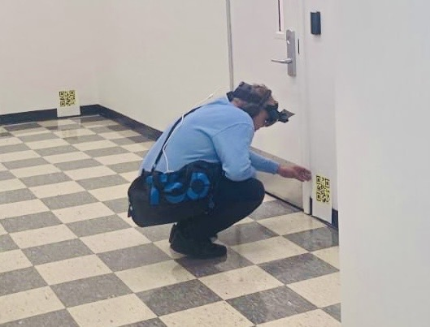
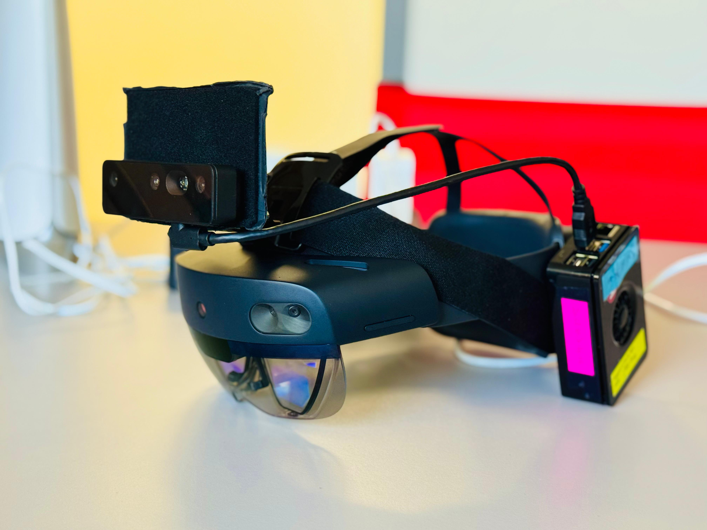
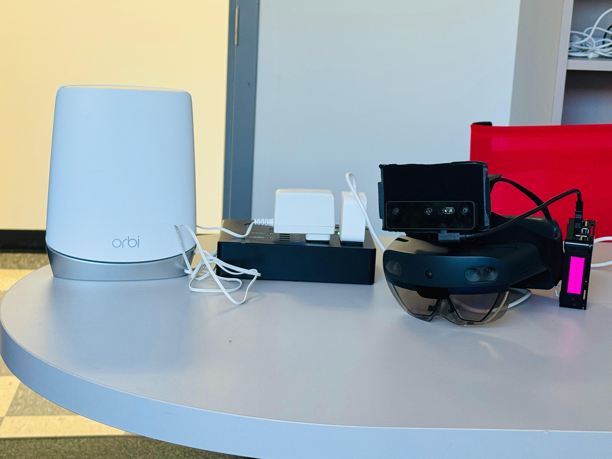
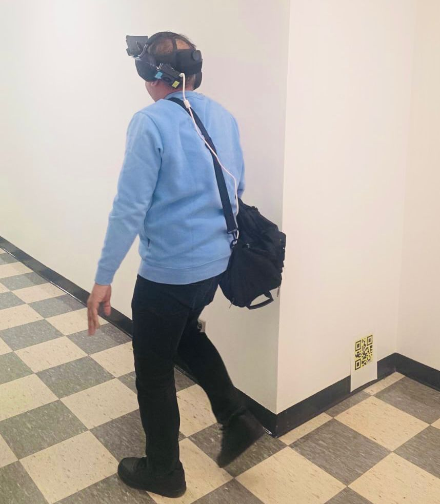

# Simulation

To simulate the Concord, redirect to this repository

[Click here to navigate to Simulation repository](https://github.com/Connected-and-Autonomous-Systems-Lab/HumanRobotSim.git)

# Run real world experiment

The following is a speeded instance of an user searching and acknowledging of QR codes around GITC 4th floor, NJIT.

<video width="640" height="360" controls>
  <source src="readme_files/oakd_slam_on_gitc4_timelapse.mp4" 
  type="video/mp4">
</video>

  

## Requirements

1. ROS2 Humble [Get Started](https://docs.ros.org/en/humble/Installation.html)
2. ROS2 packages (install via `sudo apt install ...`):
   - ros-humble-nav2-bringup
   - ros-humble-slam-toolbox
   - ros-humble-turtlebot3-cartographer
   - ros-humble-ros-tcp-endpoint
   - ros-humble-rviz2
   - ros-humble-tf2-ros
3. Turtlebot4 Standard [Get Started with Turtlebot4 Standard](https://turtlebot.github.io/turtlebot4-user-manual/setup/basic.html)

### Run realworld demonstration

(Under development) This runs an instance of Concord (Human-in-the-loop exploration) at GITC 4th floor, NJIT. Both human and turtlebot4 data are stored in ros2 bags when a Human-in-the-loop exploration is conducted.

ros2 launch collaborate run_demo.launch.py

### Run turtlebot4 asynchronously

This runs the turtlebot4 with already saved realworld human data. To lookup what the human data(ros2 bag) contains, refer the dataset documentation.

The following starts the collected human data on GITC 4th floor, NJIT.

ros2 launch hololens_ros2_bridge collaborate_async.launch.py

The following starts the turtlebot4 with navigation. To learn how to get started with Turtlebot4, refer the official documentation. [Get Started with Turtlebot4 Standard](https://turtlebot.github.io/turtlebot4-user-manual/setup/basic.html)

ros2 launch basic_turtlebot4 slam.launch.py

The following starts the Concord (Human-in-the-loop exploration for turtlebot)

ros2 launch collaborate concord.launch.py

## Run Turtlebot4 and Human synchronousely (Documentation under development)

Instead of using the userstudy data, if you want to have your own human headset, you will need to follow the additional requirements.

### Additional Requirements for headset

  
  
  

1. Hololens2 [Product](https://learn.microsoft.com/en-us/hololens/hololens-commercial-features)
2. RaspberryPi 5 [Product](https://www.raspberrypi.com/products/raspberry-pi-5/)
3. OAK-D camera [Product](https://docs.luxonis.com/hardware/products/OAK-D%20Pro)
4. Powerbank capable of delivering AC and DC. [Powerbank we used](https://www.ebay.com/itm/236368640961?chn=ps&norover=1&mkevt=1&mkrid=711-117182-37290-0&mkcid=2&mkscid=101&itemid=236368640961&targetid=2295557532670&device=c&mktype=pla&googleloc=9003544&poi=&campaignid=21388819155&mkgroupid=173029508548&rlsatarget=pla-2295557532670&abcId=9447217&merchantid=114754267&gad_source=1&gad_campaignid=21388819155&gbraid=0AAAAAD_QDh9jPnM_oqFOksZsT_4VFhHVN&gclid=Cj0KCQiAgbnKBhDgARIsAGCDdldxvuLYyBrT5zp3LVymghit18GrSErPeK-NqysLLw58UMCMqx72SDIaArlOEALw_wcB)
